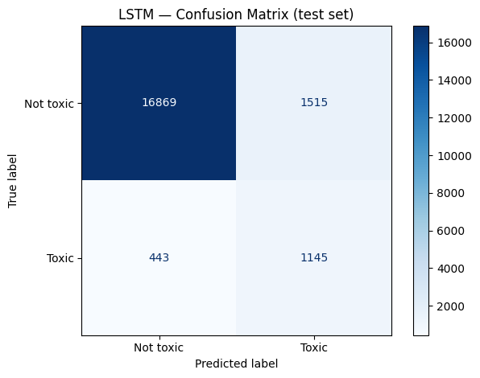

# Jigsaw Unintended Bias in Toxicity Classification

[](https://colab.research.google.com/github/IshanAgr123/jigsaw-toxicity-classification/blob/main/toxicity_classifier.ipynb)

An NLP project that classifies online comments as toxic or non-toxic, built on Google Jigsaw's Civil Comments dataset. It compares classical machine learning baselines (TF-IDF with Logistic Regression and LinearSVC) against an LSTM with learned word embeddings, and deals with the dataset's heavy class imbalance.

## The problem

Online platforms get far more comments than humans can moderate, so the goal is a model that reads a comment and predicts whether it is toxic.

The dataset is named for its real challenge: unintended bias. Models often learn that identity words (like "gay", "muslim", or "black") show up a lot in toxic comments, because those groups get attacked, and then start treating the words themselves as toxic. A neutral sentence like "I am a proud gay man" can end up wrongly flagged. Measuring and reducing that bias is the harder part of the problem.

## Dataset

- Source: Jigsaw Unintended Bias in Toxicity Classification (Civil Comments) on Kaggle
- Size: about 1.8M comments. I sampled 100K for faster experimentation.
- Label: original toxicity score from 0 to 1, converted to toxic / non-toxic at a 0.5 cutoff
- Class imbalance: about 11.5 : 1 (clean to toxic). Only around 8% of comments are toxic.

## Approach

The project runs two tracks and compares them.

Track A, classical ML: TF-IDF / CountVectorizer features with a 20K vocabulary, then majority-class undersampling to fix the imbalance, then Logistic Regression and LinearSVC.

Track B, deep learning: tokenize and pad the comments, then an Embedding layer for learned word vectors, an LSTM, and a Dense sigmoid output. Here the imbalance is handled with class weights instead of undersampling, so no data is thrown away.

## Results

Evaluated on a held-out, stratified 20% test set (the natural 11.5:1 distribution, kept untouched during training). The metrics below are for the toxic class.

| Metric    | Logistic Regression | LSTM  |
|-----------|---------------------|-------|
| Precision | 0.36                | 0.40  |
| Recall    | 0.77                | 0.80  |
| F1-score  | 0.49                | 0.54  |
| Accuracy  | 0.87                | 0.89  |
| ROC-AUC   | 0.906               | 0.917 |



The LSTM beat the linear baseline on every metric, but only by a little (about +0.01 ROC-AUC), and it took much longer to train. For a production system the simpler and faster Logistic Regression would be a reasonable choice. More complexity does not always pay off.

## Pipeline

1. Load and sample the data (100K comments)
2. Clean the text: lowercase, strip URLs and punctuation
3. Binarize the toxicity score at 0.5
4. Stratified 80/20 train/test split
5. Classical: TF-IDF, undersample, then Logistic Regression and LinearSVC
6. Deep learning: tokenize and pad, then Embedding and LSTM with class weights
7. Evaluate both on the held-out test set and compare

## Tech stack

Python, scikit-learn, imbalanced-learn, TensorFlow / Keras, pandas, NumPy, Matplotlib.

## How to run

The easiest way is to open the notebook in Colab using the badge at the top (free GPU, no setup). To run locally:

```bash
pip install -r requirements.txt
```

Then open `toxicity_classifier.ipynb`. You will need a Kaggle account to download the dataset. The steps are in the notebook.

## Future work

- Subgroup bias analysis, which is the main point of this competition. Compute per-identity metrics (Subgroup AUC, BPSN, BNSP) to check whether the model unfairly flags comments that mention specific identities, then work on reducing it. This is my next step.
- Report PR-AUC along with ROC-AUC, since it is more informative on imbalanced data.
- Try pretrained embeddings (GloVe) or fine-tune a transformer like BERT for a likely improvement.
- Add subword or character-level handling so the model is harder to fool with tricks like "idi0t".
